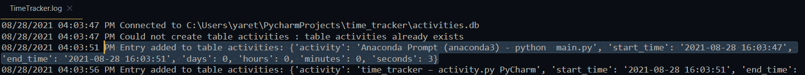
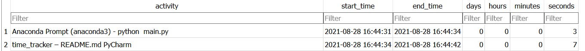

# Time Tracker

This app will tell you how do you spend your days. It will collect and store the active windows using 
sqlite db so you can apply filters and get some insights in your day to day activities

## How to run it
- First you need to have [anaconda](https://www.anaconda.com/) installed.

- Clone the repo and open the anaconda terminal in the project root. Run the following command
    ````commandline
    conda create --name time_tracker --file requirements.txt
    ````
    This will create a new conda environment called _time_tracker_
    
- Run the following command to activate your new environment:
    ````commandline
    conda activate time_tracker
    ````
- Run the script
    ````commandline
    python main.py
    ````
  
## Output
We have two outputs:
- TimeTracker.log

Here we can see the database connection an table creation (if needed) and the activities we performed
while the script running. We have the start and end date, as well as the time we spent for each activity

- activities.db
The same information as in time_tracker.log is stored in an sqlite database. The difference is that
this db is not deleted each time we run the script again. It keeps track of all the history. To see
 the content of this db you can use [sqlite browser](https://sqlitebrowser.org/dl/) or create 
 another python program to further process it. This is how it looks like
 
